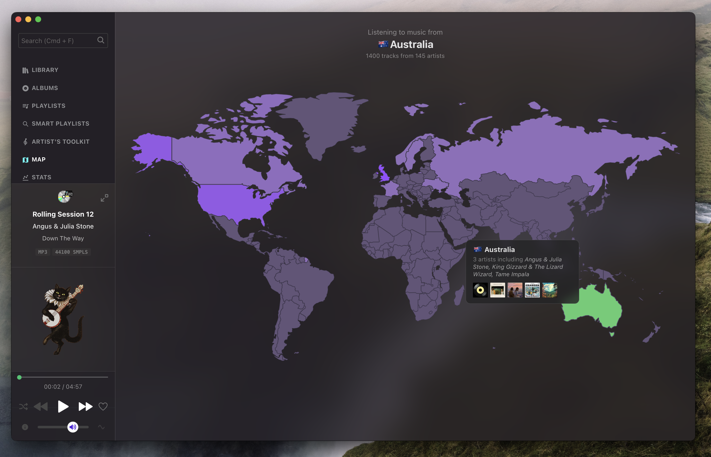
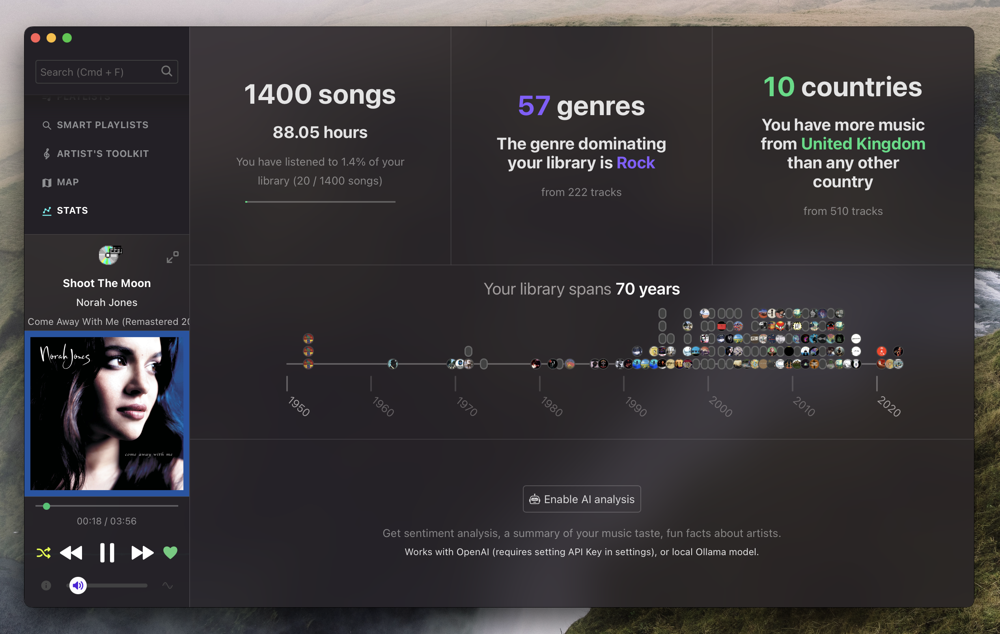

<h1 align="center">Musicat</h1>

<b>A sleek player for your local music library</b>
 
-
 
<small>🔗 linked music library, using original files on disk</small>
 
<small>🏷 with metadata tagging support (read and write ID3v2, Vorbis)</small>
 
<small>💿 a neat mini-player
</small>
 
<small>🪕 Artist's toolkit for musicians
</small>
 
<small>🗺 World Map view - see your library on a map
</small>
 
<small>📊 Stats, album timeline
</small>
 
<small>🤖 Dive deeper with ChatGPT or local Ollama model for additional insights.
</small>
 
  -

Note: musicat is currently in major version zero (0.x) active development, and features are being added regularly. Things may break or change at any time! Keep an eye out for new releases, report bugs and give feedback!

## Screenshots

## Features

-   Music player with support for MP3, FLAC, WAV, AAC, OGG
-   Albums view
-   Playlists
-   Use Smart Query to create smart auto-updating playlists based on rules eg. "tracks that contains 'love' released after 1950, longer than 4 mins"
-   World Map view - you can enrich your library with artist origin country data from Wikipedia
-   Stats view - get insights into your library.
-   Integrated with ChatGPT (requires OpenAI API key), or local Ollama model for additional insights.
-   Mini-player and oscilloscope visualizer
-   Sorting by artist = viewing the discography. Artists shown in alphabetical order. Albums in chronological order. Tracks in album order.,
-   Toggle library view between lossy/lossless/both
-   Edit file metadata including embedded artwork

### For musicians

-   Keep your messy ideas in the Scrapbook - audio/video clips, text files, links, etc. Tag them and easily find them later.
-   Manage your music in the Artist's toolkit
    -   Manage your artists and musical projects
    -   Create song entries, add info and lyrics
    -   Attach files (or drag from the scrapbook), from cool riffs to final masters.
-   Look up chords/lyrics in DuckDuckGo, go to artist on Wikipedia

## Build locally

Pre-requisites: Set up the [Tauri](https://tauri.app/) framework.

You can then create a development build using `npm run tauri dev`.

### macOS Universal build

To generate a Universal build for macOS:
`npm run tauri build -- --target universal-apple-darwin`

### Windows, Linux

Windows and Linux builds have not been tested yet, but you can generate this using `npm run tauri build` on your system.

## Keyboard Shortcuts

-   <small><kbd>**`Cmd`**</kbd> + <kbd>**`F`**</kbd></small> : Search
-   <small><kbd>**`Up`**</kbd> / <kbd>**`Down`**</kbd></small> : Highlight next, prev track (also in metadata viewer/editor)
-   <small><kbd>**`ENTER`**</kbd></small> : Play highlighted track
-   <small><kbd>**`Shift`**</kbd> + <kbd>**`Click`**</kbd></small> : Highlight multiple tracks
-   <small><kbd>**`Space`**</kbd></small> : Play / pause
-   <small><kbd>**`I`**</kbd></small>: Show Info & Metadata

`This app is built using Svelte + Tauri.`
