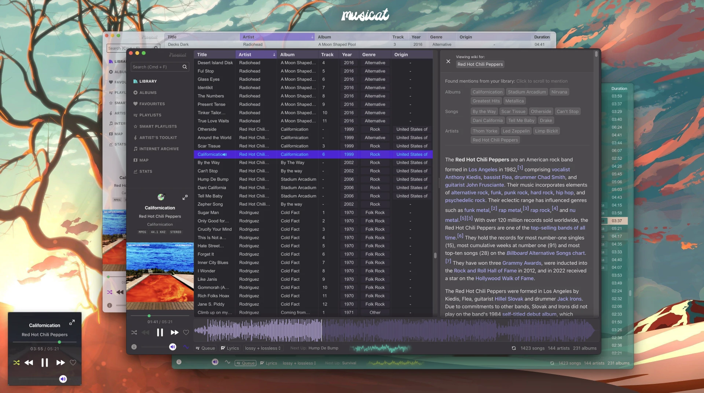
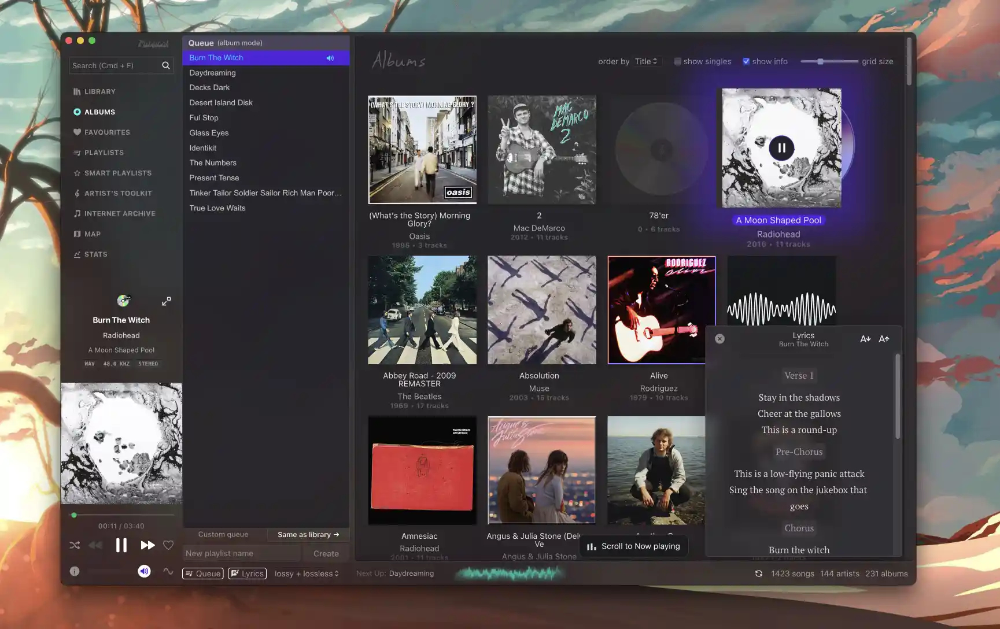
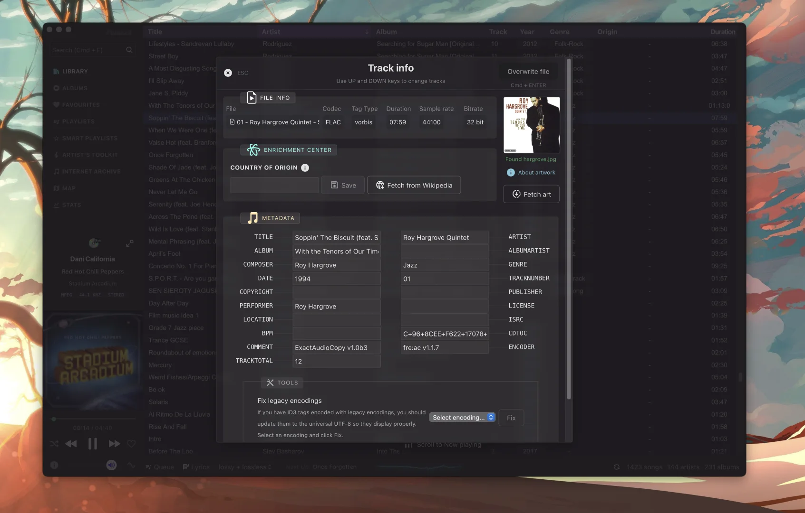
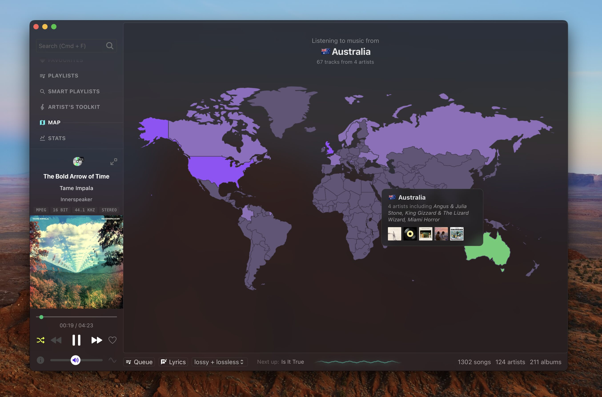
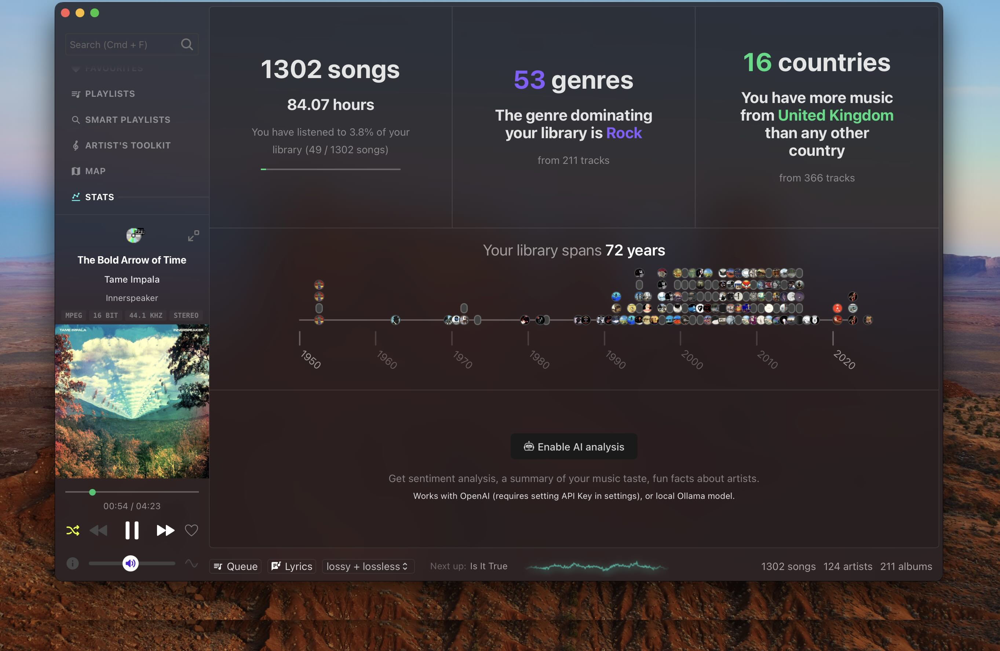

<p align="center">

</p>
<h1 align="center">Musicat</h1>
<p align="center">
<b>A sleek player for your local music library</b>
<br/>
-
<br/>
<small>🎵 supports MP3, FLAC, WAV, AAC, OGG</small>
<br/>
<small>🔊 gapless playback (same sample rate only)</small>
<br/>
<small>🎛️ auto-switch device sample rate</small>
<br/>
<small>🔗 linked library, using original files on disk</small>
<br/>
<small>👀 auto-watch and re-scan folders</small>
<br/>
<small>🏷 with metadata tagging support (read and write ID3v2, Vorbis)</small>
<br/>
<small>🧠 smart playlists</small>
<br/>
<small>🖼 download album art, origin country from Wikipedia
</small>
<br/>
<small>🎤 fetch lyrics for current song
</small>
<br/>
<small>🗺 World Map view - see your library on a map
</small>
<br/>
<small>💿 a neat mini-player
</small>
<br/>
<small>🎸 U2's latest album automatically added to your library
</small>
<br/>
<small>📊 Stats, album timeline
</small>
<br/>
<small>🌊 Waveform view
</small>
<br/>
  -
</p>



> [!WARNING]
> musicat is currently in major version zero (0.x) active development, and features are being added regularly. Things may break or change at any time! Keep an eye out for new releases, report bugs and give feedback!

> [!IMPORTANT]
> musicat has moved from WebAudio towards native playback in Rust, read more and discuss [here](https://github.com/basharovV/musicat/discussions/6)

## Introduction

This is a player that I built for personal use, with the goal of re-connecting with my local music library in the age of streaming. It's pleasant to use, with a modern UX that is fresh yet feels familiar to classic software like Winamp, foobar2000 and iTunes. It's fast, audiophile-friendly and can handle large libraries of all formats. I wanted to create a tool that puts me as the listener back in the driver's seat, taking an active role in organizing and enriching my library of music that I curate with passion.

## For melomaniacs

Musicat also strives to be a meta-layer on top of your library. Features like Map View and Stats are all derived from the question - _"how can I connect more with my music collection?"_. They might seem like gimmicks, but there is a lot of room to explore this idea, and this app is the perfect playground to do that. Whether it's learning about the artists via a Wikipedia panel, or getting a glimpse into your listening habits, you can expect more functionality of this sort to be built into the app.

## For artists & musicians

As a musician, I also wanted to organize my own music that I've made over the years, or tag bands that I've played in, and use the app as a way to build your own discography, as well as a knowledge base of new song ideas and lyrics. I created a prototype feature called "Artist's Toolkit" (enable in Settings) that captures this idea. It's half-baked at the moment, but it has already proven useful as a concept.


## Features in progress
There's a lot of things in my personal wishlist, but here are the things that I'm working on or thinking about currently: 

🌐 **Internationalization**
<small>&nbsp;&nbsp;&nbsp;●●●●●○○○○○</small>
</br>
<small>Once done, contributors can add new languages by adding a locale file eg. `src/i18n/it/index.ts`.</small>

🎨 **Theme Support**
<small>&nbsp;&nbsp;&nbsp;●●●●●●●●○○</small>
</br>
<small>[→ See built-in themes and discuss here](https://github.com/basharovV/musicat/discussions/15)</small>

📖 **Knowledge/Wiki panel**
<small>&nbsp;&nbsp;&nbsp;●●●○○○○○○○</small>
</br>
<small>A built-in Wikipedia reader for artists/albums/songs which makes interesting connections to your library.</small>

📖 **Linux/Windows builds**
<small>&nbsp;&nbsp;&nbsp;●○○○○○○○○○</small>
</br>
<small>via Tauri's Github action</small>

📖 **Auto-updates**
<small>&nbsp;&nbsp;&nbsp;○○○○○○○○○○</small>
</br>
<small>Need to see how to do this with Tauri and Github releases</small>

## Screenshots








## Keyboard Shortcuts

-   <small><kbd>**`Cmd`**</kbd> + <kbd>**`F`**</kbd></small> : Search
-   <small><kbd>**`Up`**</kbd> / <kbd>**`Down`**</kbd></small> : Highlight next, prev track (also in metadata viewer/editor)
-   <small><kbd>**`ENTER`**</kbd></small> : Play highlighted track
-   <small><kbd>**`Shift`**</kbd> + <kbd>**`Click`**</kbd></small> : Highlight multiple tracks
-   <small><kbd>**`Space`**</kbd></small> : Play / pause
-   <small><kbd>**`I`**</kbd></small>: Show Info & Metadata
-   <small><kbd>**`Q`**</kbd></small>: Open the Queue
-   <small><kbd>**`A`**</kbd></small>: Go to Albums
-   <small><kbd>**`L`**</kbd></small>: Go to Library

`This app is built using Svelte + Tauri.`

## Running on Linux 🐧

Musicat uses ALSA on Linux, install it if you don't already have it on your system:

```
sudo apt-get install libasound2-dev
```

## Build locally

1. Set up the [Tauri](https://tauri.app/) framework and it's [prerequisites](https://tauri.app/v1/guides/getting-started/prerequisites/) depending on your platform
2. Run `npm install` (using Node version 18)
3. You can then create a development build using `npm run tauri dev`.

## Contributing

Pull requests are very welcome. For major changes, please open an issue first to discuss what you would like to change.

## License

[GPL-3.0](https://www.gnu.org/licenses/gpl-3.0.en.html)
